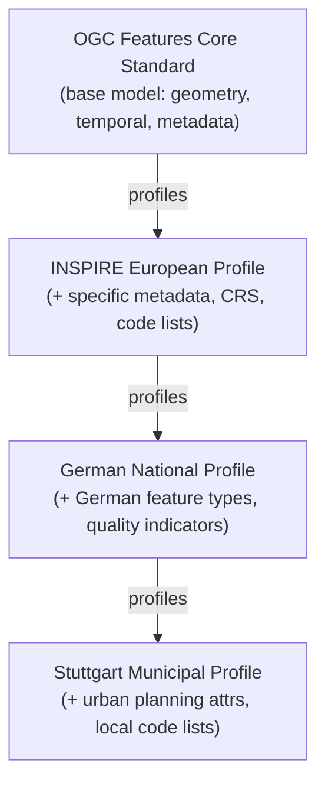

# The Architecture in Detail

How machine-readable standards, profiles, building blocks, and registers work together to create a composable, federated ecosystem.

## Anatomy of a Machine-Readable Standard {#standards}

The foundational requirement is that every standard — and every component within a standard — must be addressable, describable, and constrainable in a machine-readable form. This does not mean that human-readable documents disappear. Rather, it means that the **canonical form of a specification is machine-readable**, and human-readable documents are derived from it.

This inversion is critical: it ensures that the machine-readable form remains authoritative and complete, rather than a secondary artifact that may drift out of sync with the document. This approach doubles down on emerging best practices already gaining traction across the industry. OpenAPI, for example, embodies this principle.

| Component | Description |
|---|---|
| **Canonical URI** | A persistent, resolvable identifier for the standard. Resolves to a landing page with content negotiation, serving HTML for browsers and RDF/JSON-LD for machines. |
| **Metadata Descriptor** | Title, abstract, version, status, maintainer, domain classification, license, and temporal validity. Expressed in a standard metadata vocabulary (e.g., DCAT, Dublin Core extended with OGC-specific terms). |
| **Structural Schemas** | Formal data models in one or more schema languages: JSON Schema for JSON encodings, XML Schema for XML, SHACL or OWL for semantic models. Multiple representations may coexist, linked by equivalence declarations. |
| **Constraint Rules** | Machine-executable validation rules beyond schema validation: co-occurrence constraints, conditional requirements, cross-element rules, value-dependent logic. Expressed in SHACL, Schematron, or equivalent rule languages. |
| **Dependency Graph** | Machine-readable declarations of all dependencies on other standards and building blocks, including version constraints and the nature of each dependency (imports, extends, constraints, profiles). |
| **Tested Examples** | Reference instances that conform to the standard, automatically validated against schemas and constraint rules as part of a continuous integration pipeline. |
| **Human Documentation** | Derived from the canonical machine-readable forms. The traditional specification document — generated rather than authored independently — ensuring consistency with the machine-readable artifacts. |

Beyond structural schemas, a machine-readable standard also captures constraints that go beyond what schemas alone can express — rules that define valid usage such as co-occurrence constraints, conditional requirements, value-dependent behaviors, and cross-element validation logic. These constraints are expressed in formal rule languages and are automatically executable, meaning that any instance claiming conformance can be validated programmatically.

## The Profiling Mechanism {#profiles}

A profile is a constrained and potentially extended version of one or more base standards, tailored to the needs of a specific community, jurisdiction, application domain, or use case. The key architectural principle is that **a profile is not a fork**. A profile maintains a formal, machine-readable relationship to its base standard(s).

### What Profiles Do

- **Narrow Optionality** — Where a base standard permits multiple encoding choices, a profile may mandate one.
- **Add Domain Semantics** — A profile of a generic feature model may define the specific feature types, attributes, and value domains relevant to a national mapping programme.
- **Impose Stricter Constraints** — A profile may require elements that the base standard leaves optional, restrict value ranges, or impose stricter cardinality.
- **Add Extensions** — Additional elements, code lists, or behaviors that the base standard does not address but the community requires.

### Profile Layering Example

Profiles can be layered in a hierarchy. Consider a concrete example from the geospatial domain:

At each layer, the profile inherits all constraints from below and adds its own. The machine-readable dependency chain enables a validator to automatically assemble the complete set of applicable rules. A dataset validated against the municipal profile is guaranteed to conform to all standards and profiles in the chain.

### Cross-Profile Interoperability

Because profiles share common bases, data from different communities can be exchanged at the level of their shared ancestor. A German municipal dataset and a French regional dataset may use incompatible local profiles, but both conform to the INSPIRE profile and are therefore processable by any INSPIRE-compliant system.

Software can recognize profiles by name, including their base profiles, and automatically respond with preconfigured functionality. This is fundamentally impossible in a world of copy/paste duplication, where similar standards contain subtly different descriptions of the same concepts.

## The Register Infrastructure {#registers}

Registers are the connective tissue of the ecosystem — authoritative, curated catalogs that make all assets discoverable, addressable, and interconnected. The architecture is federated and hierarchical, following a pattern analogous to the Domain Name System.

| Register | Contents & Purpose |
|---|---|
| **Standards Building Blocks** | All reusable specification components: schema fragments, constraint rules, extension point definitions, code lists, and conceptual model elements. The primary library from which standards and profiles are composed. |
| **Standards Register** | Published standards with full machine-readable descriptions, dependency graphs, and links to constituent building blocks. Includes version history and normative status. |
| **Profile Register** | Community-specific profiles organized by domain and jurisdiction. Includes the profiling relationship chain and links to constraints, vocabulary bindings, and extensions. |
| **Implementation Register** | Software products, libraries, and services that implement standards. Linked to conformance test results and deployment metadata. |
| **Transformation Register** | Mappings and transformation engines that convert data between standards, profiles, or encodings. Each entry specifies source, target, transformation logic, and quality metadata. |
| **Validation Register** | Conformance test suites, validators, and test harnesses. Linked to the standards and profiles they test. Enables automated conformance testing as a service. |
| **Feature Type Catalog** | A federated, DNS-like catalog of real-world feature types. Enables semantic discovery: finding data about buildings, rivers, or soil types regardless of standard or encoding used. |
| **Vocabulary Register** | Code lists, controlled vocabularies, and classification systems. Supports multilingual labels, hierarchical relationships, and mapping between equivalent vocabularies. |

### Federation and the DNS Analogy

OGC acts as the root authority, defining the structural patterns that all registers must follow and operating the resolution protocol. Domain authorities — national mapping agencies, thematic communities, regional bodies, industry consortia — operate their own register nodes that conform to the root patterns but are independently governed.

The resolution mechanism works hierarchically: a query for a specific asset starts at the local node. If unknown locally, the query escalates upward — potentially reaching the root — which redirects to the appropriate domain authority. At each level, the register API is consistent, enabling clients to traverse the federation without special knowledge of individual nodes.

The architecture supports caching and replication at every level for resilience, offline access, air-gapped operational contexts, or performance. The provenance metadata ensures consumers always know the authoritative source.

## Operational Workflows {#workflows}

### Publishing a Standard

The workflow differs significantly from traditional document-centric processes:

1. The standard is authored in a **machine-readable canonical form**. Schema fragments in JSON Schema or XML Schema; constraints in SHACL or Schematron; dependencies declared explicitly.
2. Examples are written and **automatically validated** against schemas and constraint rules in a CI pipeline. Any failure halts publication.
3. Human-readable documentation is **generated from the canonical forms**, ensuring consistency. Authors may enrich with explanatory text, but normative content is derived.
4. The standard and all constituent building blocks are **registered** with full metadata, dependency declarations, and provenance.
5. The standard's URI becomes **resolvable**, pointing to a landing page that serves machine-readable metadata via content negotiation and human-readable documentation.
6. Automated conformance validators are published in the **Validation Register**, enabling immediate testing of implementations.

### Creating a Profile

A community specializing a standard follows a parallel workflow:

1. Identify the base standard(s) and define specializations: restrictions, constraints, extensions, and vocabulary bindings.
2. Express each specialization as a **machine-readable delta** against the base — additional SHACL shapes, new building blocks, vocabulary bindings linking to the Vocabulary Register.
3. Validation rules are **assembled automatically** by combining the base standard's rules with the profile's additions. Examples are validated against the combined set.
4. The profile is **registered** with its profiling chain explicitly declared, triggering dependency graph updates and making it visible to consumers.

### Discovering and Using Assets

A data publisher, developer, or AI agent follows a discovery workflow:

1. **Query** the register infrastructure for matching assets — feature types, validators, transformations.
2. **Retrieve** matching assets with full metadata, dependency chains, and related links.
3. **Use** the artifacts programmatically: validate data against schemas and constraints, transform using registered engines, implement APIs against registered specifications.
4. **Register** your own implementation in the Implementation Register, closing the loop and enriching the ecosystem.

## AI Readiness {#ai-readiness}

The machine-readable ecosystem is inherently AI-ready. Specific design considerations maximize its utility for AI agents:

- **Structural Information** — API definitions and schemas provide the structural information AI agents need to formulate valid queries and interpret responses.
- **Guardrails** — Constraint rules enable AI agents to validate their own outputs before submitting them.
- **Programmatic Discovery** — The register infrastructure provides a traversable discovery mechanism, enabling agents to find assets without human guidance.
- **Trust Assessment** — Provenance metadata enables AI agents to assess the trustworthiness and currency of the assets they discover.
- **Few-Shot Learning** — Validated examples serve as few-shot learning material, enabling AI agents to understand expected patterns by inspecting instances.
- **Continuous Testing** — AI consumption testing embedded in CI pipelines ensures that every standard remains usable by AI agents as it evolves.

:::note Lesson from the DGGS AI Pilot
The OGC DGGS AI Pilot demonstrated both the potential and the challenges — servers were overwhelmed by AI-generated requests, and agents lacked sufficient context to formulate effective queries. The machine-readable ecosystem addresses this by providing rich, structured metadata that enables AI agents to understand what an API offers, which constraints apply, and how to interact efficiently, *before making their first request*.
:::

## Integrity, Provenance, and Trust {#ipt}

The register-based ecosystem provides the foundation for a comprehensive IPT framework that permeates every layer.

- **Integrity** — Machine-readable constraints and automated validation. Data, implementations, and derived products can be checked for conformance at any point.
- **Provenance** — Every asset has a documented origin, governance chain, version history, and dependency graph. Conformance claims are fully traceable.
- **Trust** — The combination of integrity and provenance with governance enables consumers to make informed trust decisions based on authority, rigor, and completeness.

The IPT pattern applies universally: whether a mapping agency is aggregating intelligence, a weather service is managing hundreds of variables, a biodiversity system is combining datasets, or a risk platform is computing indices — the fundamental requirement is the same: knowing what the data represents, where it came from, how it was processed, and whether it can be trusted.

## Relationship to OGC Policy {#policy}

For this architecture to succeed, OGC's policies and procedures will need to evolve alongside it. The following are suggested policy directions for members to consider — proposals intended to open a conversation, not prescriptive mandates.

### Meta-Principles for Policy Design

- **Technology-Neutral** — Policies should define outcomes and requirements, not the tools used to achieve them.
- **Implementation-Backed** — No policy should be adopted unless a viable, demonstrated implementation pathway exists.
- **Fully Resourced** — Where OGC endorses an implementation pathway, the organization should ensure it is adequately maintained and supported.
- **Continuously Tested** — Testing of policy and feasibility of implementation should be embedded in the standards programme.

### Eight Suggested Policy Initiatives

1. **URI-addressable standards components** with landing pages serving human-readable and machine-readable forms.
2. **Collaborative, version-controlled publication environments** supporting collaboration, versioning, proposals, and automation.
3. **Documents derived from canonical machine-readable forms** to the greatest extent possible.
4. **Automatically tested examples** for compliance with canonical specifications.
5. **Formal machine-readable constraint rules** supporting automated testing.
6. **Machine-readable dependency declarations** to support FAIR principles and automated reasoning.
7. **Clearly tested profiling and extension patterns** for community specialization.
8. **Registration of all standards components** in appropriate registers with defined interoperability requirements.
