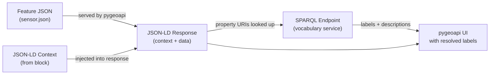

import Tabs from '@theme/Tabs';
import TabItem from '@theme/TabItem';

# Serve and visualize the data

We now have a validated, semantically annotated dataset. In this section we
serve it through a custom pygeoapi instance that understands our block's
JSON-LD context. The result is an API that not only returns GeoJSON but also
exposes a linked data view of each feature — one where every property label is
resolved against its vocabulary URI and displayed alongside its definition.

## About the custom pygeoapi image

[pygeoapi](https://pygeoapi.io/) is an open-source Python server that
implements several OGC API standards. Core pygeoapi already supports a
`linked-data` configuration block for collections, which allows it to inject
a JSON-LD `@context` into feature responses and declare the `item_type` of
the collection's features.

The `dockerogc/pygeoapi` image used in this tutorial is a customized variant
maintained by the OGC that extends this built-in `linked-data` support with
additional capabilities:

- `inject_verbatim_context` — injects the listed context URLs directly into
  responses, bypassing pygeoapi's default context handling. This is necessary
  when serving a custom, externally-defined context such as ours.
- `replace_id_field` — replaces a named feature field with the pygeoapi item
  URL in linked data responses, so that the published URI resolves directly to
  the API endpoint.
- `fallback_sparql_endpoint` — looks up vocabulary URIs in a SPARQL endpoint
  to retrieve human-readable labels and definitions for display alongside the
  data in the UI.

## Prepare the data

The pygeoapi GeoJSON provider reads from a **GeoJSON FeatureCollection** file —
a JSON object with `"type": "FeatureCollection"` containing an array of
features. The `sensor.json` we created in Section 2 is a single Feature; we
need to wrap it.

Create a new file called `sensors.geojson`:

```json
{
  "type": "FeatureCollection",
  "features": [
    {
      "type": "Feature",
      "id": "stations/alpha",
      "geometry": {
        "type": "Point",
        "coordinates": [-3.70325, 40.41650]
      },
      "properties": {
        "name": "Station Alpha – Madrid Centro",
        "serialNumber": "AQS-2024-0042",
        "hasObservations": [
          {
            "observedProperty": "http://vocab.nerc.ac.uk/standard_name/mass_concentration_of_nitrogen_dioxide_in_air/",
            "hasResult": {
              "http://qudt.org/schema/qudt/value": 42.7,
              "http://qudt.org/schema/qudt/hasUnit": { "@id": "http://qudt.org/vocab/unit/MicroGM-PER-M3" }
            },
            "resultTime": "2024-06-01T12:00:00Z"
          },
          {
            "observedProperty": "http://vocab.nerc.ac.uk/standard_name/mass_concentration_of_pm10_ambient_aerosol_particles_in_air/",
            "hasResult": {
              "http://qudt.org/schema/qudt/value": 18.3,
              "http://qudt.org/schema/qudt/hasUnit": { "@id": "http://qudt.org/vocab/unit/MicroGM-PER-M3" }
            },
            "resultTime": "2024-06-01T12:00:00Z"
          }
        ]
      }
    }
  ]
}
```

## Set up the directory structure

Create a dedicated working directory for this step with a `data/` subdirectory:

```
pygeoapi-tutorial/
├── pygeoapi.config.yml
└── data/
    └── sensors.geojson
```

<Tabs groupId="os">
<TabItem value="linux" label="Linux">

```bash
mkdir -p pygeoapi-tutorial/data
cp sensors.geojson pygeoapi-tutorial/data/
cd pygeoapi-tutorial
```

</TabItem>
<TabItem value="macos" label="macOS">

```bash
mkdir -p pygeoapi-tutorial/data
cp sensors.geojson pygeoapi-tutorial/data/
cd pygeoapi-tutorial
```

</TabItem>
<TabItem value="windows" label="Windows">

```powershell
mkdir pygeoapi-tutorial\data
Copy-Item sensors.geojson pygeoapi-tutorial\data\
cd pygeoapi-tutorial
```

</TabItem>
</Tabs>

Inside this directory, create `pygeoapi.config.yml` as described below. We
will mount both this file and the `data/` directory into the container when
we run it.

## Create `pygeoapi.config.yml`

Create `pygeoapi.config.yml` with the following content. The standard
pygeoapi `server` and `metadata` sections are included for completeness;
the important part for this tutorial is the `linked-data` block at the end.

```yaml
server:
  bind:
    host: 0.0.0.0
    port: 80
  url: http://localhost:5000
  mimetype: application/json; charset=UTF-8
  encoding: utf-8
  gzip: false
  language: en-US
  cors: true
  pretty_print: true
  limit: 10
  map:
    url: https://tile.openstreetmap.org/{z}/{x}/{y}.png
    attribution: '&copy; <a href="https://osm.org/copyright">OpenStreetMap contributors</a>'

logging:
  level: ERROR

metadata:
  identification:
    title: Air Quality Sensors
    description: Semantically enriched air quality monitoring station data
    keywords:
      - air quality
      - sensors
      - observations
    keywords_type: theme
    terms_of_service: https://creativecommons.org/licenses/by/4.0/
    url: https://example.com
  license:
    name: CC-BY 4.0 license
    url: https://creativecommons.org/licenses/by/4.0/
  provider:
    name: My Organisation
    url: https://example.com
  contact:
    email: you@example.com
    url: https://example.com

resources:
  air-quality-sensors:
    type: collection
    title: Air Quality Sensor Stations
    description: Monitoring stations with air quality observations
    keywords:
      - air quality
    links: []
    extents:
      spatial:
        bbox: [-180, -90, 180, 90]
        crs: http://www.opengis.net/def/crs/OGC/1.3/CRS84
    providers:
      - type: feature
        name: GeoJSON
        # The data path is inside the container. We will mount data/ to /data.
        data: /data/sensors.geojson
        id_field: id
        title_field: name

    # ------------------------------------------------------------------
    # linked-data: a standard pygeoapi configuration block for semantic
    # enrichment. dockerogc/pygeoapi extends it with inject_verbatim_context,
    # replace_id_field, and fallback_sparql_endpoint (see below).
    # ------------------------------------------------------------------
    linked-data:
      item_type: geo:Feature

      # inject_verbatim_context (extension): when true, inserts the @context
      # listed below directly into JSON and JSON-LD responses, bypassing
      # pygeoapi's default context handling. Required when serving a custom,
      # externally-defined context such as ours.
      inject_verbatim_context: true

      # replace_id_field (extension): the feature field whose value should be
      # replaced with the pygeoapi item URL in linked data responses. Using "id"
      # here matches the id_field declared in the GeoJSON Feature block,
      # so the published URI of each feature points back to this API.
      replace_id_field: id

      # context: one or more URLs to JSON-LD context documents to inject
      # into responses. Use the URL of the context built from your block.
      #
      # How to find this URL:
      #   1. Open your published block register on GitHub Pages.
      #   2. Navigate to the Air Quality Sensor Station block.
      #   3. Open the "Semantic Uplift" tab.
      #   4. Copy the URL of the JSON-LD context file shown there.
      #
      # It follows this pattern:
      #   https://{username}.github.io/my-bblocks-register/build/annotated/
      #       tutorial/sensors/airQualitySensor/context.jsonld
      context:
        - https://{your-github-username}.github.io/my-bblocks-register/build/annotated/tutorial/sensors/airQualitySensor/context.jsonld

      # fallback_sparql_endpoint (extension): a SPARQL query endpoint used by
      # the UI to look up the label and description of vocabulary URIs when
      # they cannot be resolved directly (e.g. due to CORS restrictions).
      # Use an endpoint that serves the vocabularies referenced in your data.
      fallback_sparql_endpoint: https://defs.opengis.net/vocprez/sparql
```

Replace `{your-github-username}` with your actual GitHub username before
saving. The path in the `context` URL follows the pattern determined by your
`identifier-prefix` and block directory name, as noted in Section 1.

### Key `linked-data` settings explained

| Setting | Origin | Purpose |
|---|---|---|
| `item_type` | Core pygeoapi | Declares the RDF type of the collection's features in linked data responses. |
| `context` | Core pygeoapi | A list of JSON-LD context URLs to inject into responses. We point directly to the context built and published by the OGC Blocks postprocessor for our block. |
| `inject_verbatim_context` | `dockerogc/pygeoapi` extension | Bypasses pygeoapi's default JSON-LD handling and injects the listed `context` URLs as-is. Set to `true` whenever you provide a custom external context. |
| `replace_id_field` | `dockerogc/pygeoapi` extension | Replaces the specified feature field with the pygeoapi item URL in linked data responses, ensuring published URIs resolve to this API. `id` matches the GeoJSON Feature block's identifier field. |
| `fallback_sparql_endpoint` | `dockerogc/pygeoapi` extension | A SPARQL endpoint consulted by the UI to resolve labels and descriptions for vocabulary URIs. Should serve the vocabularies used in `observedProperty` and other URI-valued fields. |

## Run the container

From inside the `pygeoapi-tutorial/` directory, run:

<Tabs groupId="os">
<TabItem value="linux" label="Linux">

```bash
docker run --rm --pull=always \
  -v "$(pwd)/pygeoapi.config.yml:/pygeoapi/local.config.yml" \
  -v "$(pwd)/data:/data" \
  -p 5000:80 \
  dockerogc/pygeoapi:latest
```

</TabItem>
<TabItem value="macos" label="macOS">

```bash
docker run --rm --pull=always \
  -v "$(pwd)/pygeoapi.config.yml:/pygeoapi/local.config.yml" \
  -v "$(pwd)/data:/data" \
  -p 5000:80 \
  dockerogc/pygeoapi:latest
```

</TabItem>
<TabItem value="windows" label="Windows">

```powershell
docker run --rm --pull=always `
  -v "${PWD}/pygeoapi.config.yml:/pygeoapi/local.config.yml" `
  -v "${PWD}/data:/data" `
  -p 5000:80 `
  dockerogc/pygeoapi:latest
```

</TabItem>
</Tabs>

The `-v` flags mount:
- your `pygeoapi.config.yml` over the container's default config path
- your `data/` directory at `/data`, which matches the `data: /data/sensors.geojson`
  path in the config

`--rm` removes the container automatically when it exits, so no persistent
container state is created.

Once the container starts, you should see log output ending with something like:

```
Serving on http://0.0.0.0:80
```

The service is now available at **http://localhost:5000**.

## Browse the service

### The landing page

Open [http://localhost:5000](http://localhost:5000). You will see the pygeoapi
landing page with links to the available collections and the API definition.

### The collection

Navigate to [http://localhost:5000/collections/air-quality-sensors](http://localhost:5000/collections/air-quality-sensors).
This shows the collection metadata, including spatial extent and links to the
items endpoint.

### A feature

Navigate to the items endpoint:
[http://localhost:5000/collections/air-quality-sensors/items](http://localhost:5000/collections/air-quality-sensors/items)

You will see the `Station Alpha` feature returned as a GeoJSON FeatureCollection.
Click through to the individual item:
[http://localhost:5000/collections/air-quality-sensors/items/stations%2Falpha](http://localhost:5000/collections/air-quality-sensors/items/stations%2Falpha)

### The JSON-LD representation

Request the JSON-LD representation by adding `?f=jsonld` to the item URL or
by sending an `Accept: application/ld+json` header:

```bash
curl -s "http://localhost:5000/collections/air-quality-sensors/items/stations%2Falpha?f=jsonld" | python -m json.tool
```

The response will be standard GeoJSON with an injected `@context` array at the
top level, pointing at our block's published context file:

```json
{
  "@context": [
    "https://{your-github-username}.github.io/my-bblocks-register/build/annotated/tutorial/sensors/airQualitySensor/context.jsonld"
  ],
  "type": "Feature",
  "id": "http://localhost:5000/collections/air-quality-sensors/items/stations%2Falpha",
  "geometry": { ... },
  "properties": {
    "name": "Station Alpha – Madrid Centro",
    "serialNumber": "AQS-2024-0042",
    "hasObservations": [ ... ]
  }
}
```

Notice that `id` has been replaced with the full pygeoapi URL — the feature's
URI now resolves directly to this API endpoint. Any linked data client following
this URI will land on a machine-readable description of the resource.

### Semantic property enrichment

The custom pygeoapi image renders a UI page for each feature that goes beyond
the raw JSON. Open the feature in your browser:

```
http://localhost:5000/collections/air-quality-sensors/items/stations%2Falpha
```

The properties panel shows not just the field names and values but also attempts
to resolve each property's URI via the `fallback_sparql_endpoint`. For
properties whose URIs are known to the SPARQL endpoint (for example, SOSA
properties like `sosa:resultTime` or standard terms from OGC vocabularies),
the display will show the human-readable label and description alongside the
value — automatically, without any additional configuration.

This is the direct payoff of the JSON-LD context in our block: because every
field maps to a URI, the system knows *what* each value means and can retrieve
authoritative documentation for it from the vocabulary service. The same data
can now be presented meaningfully to a human viewer without any domain-specific
display logic.



---

## Epilogue: linked data in the real world

This tutorial has used placeholder URIs (`https://example.com/sensors/`,
`https://vocab.example.org/...`) and a local deployment. Before taking this
pattern into production, there are a few practical considerations worth keeping
in mind.

### DNS resolution and live testing

Linked data URIs only deliver their full value when they are dereferenceable —
that is, when an HTTP client can follow them to retrieve a description of the
resource. During local testing, URIs point to `localhost` addresses that are
invisible to external clients. This is expected for development, but means you
cannot share links and expect them to work until the service is deployed at a
public address.

Testing the full linked data lifecycle (publish a URI → resolve it → retrieve
RDF → follow further links) requires a publicly accessible deployment, not just
a local container. Reserve this step for when the data model is stable and you
are ready to commit to a URI namespace.

### Persistent, resolvable identifiers

The URIs you mint for your resources and vocabulary terms should be:

- **Persistent**: once published, they should not change. URIs that disappear
  break every system that has stored a reference to them.
- **Dereferenceable**: following the URI should return a useful description of
  the resource, either as HTML for a human or as RDF for a machine (ideally
  both, via content negotiation).

Two common approaches:

**Use a domain you control.** If your organization owns a suitable domain, dedicate
a path to your definitions (e.g. `https://data.myorg.example/sensors/`). Configure
your API at that address and use that base URI for all published resources. URIs
will resolve directly to your service.

**Use a persistent URI service.** [w3id.org](https://w3id.org) provides stable,
community-governed URI namespaces that redirect to a URL of your choice. This is
particularly useful when you do not control a suitable domain, or when you want
the URI to remain stable even if the underlying service moves: you register a
namespace (e.g. `https://w3id.org/my-org/sensors/`), configure it to redirect
to your deployment, and use that namespace as the base URI for all resources.
If you later move the service to a new host, only the w3id.org redirect needs
updating — the URIs themselves remain unchanged.

In both cases, the only things that change from what we have built in this
tutorial are the `base_uri` passed to `uplift_json` and the `url` in
`pygeoapi.config.yml`. The block definition, the data structure, and the rest of
the workflow remain exactly the same.

## Summary

You have now completed the full Applied OGC Blocks workflow:

1. **Defined** a reusable OGC Block that captures the structure and semantics
   of air quality sensor stations, building on standard GeoJSON Feature and
   SOSA Observation blocks.
2. **Published** the block to a GitHub Pages register that anyone can import,
   reference, or extend.
3. **Validated** a conformant data document against the block's schema and
   inspected its uplifted RDF representation.
4. **Served** the data through a semantics-aware API that injects the block's
   JSON-LD context into every response and resolves vocabulary URIs to
   human-readable labels.

The block you created is a publishable, reusable artifact. Partners who import
your register can validate their own data against your schema, inherit your
semantic annotations in their own blocks, or simply reference your vocabulary
mappings to align their own data to the same standard concepts — without any
manual mapping effort on either side.
