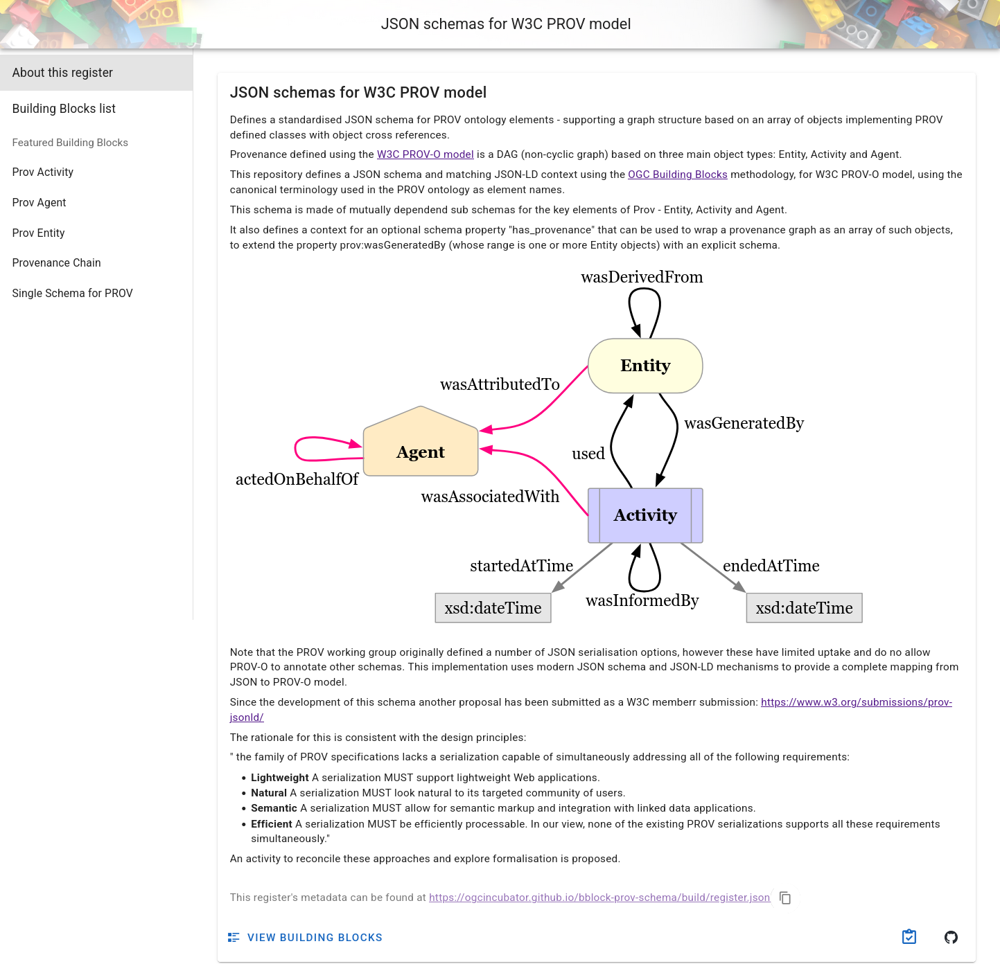
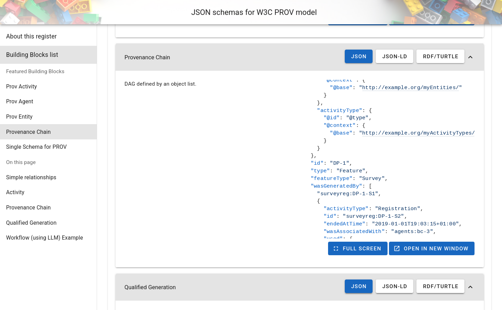

# Define the indicator

In this section we describe the Composite Drought Indicator as a
**provenance chain**: a machine-readable record of which observations were
used and how the indicator was derived from them. Rather than writing the
chain in an ad-hoc format, we use an **OGC Building Block** that provides a
shared schema, validation rules, and a JSON-LD context — so the document we
produce can be unambiguously interpreted by any system that understands the
same standard.

## The Provenance Chain OGC Building Block

OGC Building Blocks are reusable specification components that
provide a schema, JSON-LD context, and validation rules for a given data
structure. We will use the **Provenance Chain BBlock**, which is based on
the W3C PROV-O ontology and extends it for geospatial use.



The register for the provenance schemas is available at https://ogcincubator.github.io/bblock-prov-schema/ .

Out of the different available Blocks, we will use the ["Provenance Chain"](https://ogcincubator.github.io/bblock-prov-schema/bblock/ogc.ogc-utils.prov)
one, which is very flexible since it allows us to define a provenance chain starting
from an entity, an activity or an agent.

The [JSON Schema](https://ogcincubator.github.io/bblock-prov-schema/bblock/ogc.ogc-utils.prov/examples)
tab shows the full (semantically annotated) JSON Schema. You can find examples to get started under [Examples](https://ogcincubator.github.io/bblock-prov-schema/bblock/ogc.ogc-utils.prov/examples);
the full [provenance chain example](https://ogcincubator.github.io/bblock-prov-schema/bblock/ogc.ogc-utils.prov/examples) illustrates many
of the available properties.



## Writing the provenance chain

Create a file called `cdi-indicator.json`. The document describes:

1. The **indicator entity** (the CDI value itself)
2. The **computation activity** that generated it
3. The three **input entities** (observations) that the activity used

```json
{
  "id": "indicators/cdi/station-alpha/2024-07",
  "type": "Feature",
  "featureType": "CompositeIndicator",
  "name": "Composite Drought Indicator – Station Alpha – July 2024",
  "wasGeneratedBy": {
    "id": "act:cdi-computation/station-alpha/2024-07",
    "activityType": "CompositeIndicatorComputation",
    "name": "CDI computation – Station Alpha – July 2024",
    "endedAtTime": "2024-08-01T00:00:00Z",
    "used": [
      {
        "id": "obs:soil-moisture-anomaly/station-alpha/2024-07",
        "featureType": "SoilMoistureAnomaly",
        "name": "Soil Moisture Anomaly – Station Alpha – July 2024"
      },
      {
        "id": "obs:rainfall-anomaly/station-alpha/2024-07",
        "featureType": "RainfallAnomaly",
        "name": "Rainfall Anomaly – Station Alpha – July 2024"
      },
      {
        "id": "obs:vegetation-condition-anomaly/station-alpha/2024-07",
        "featureType": "VegetationConditionAnomaly",
        "name": "Vegetation Condition Anomaly – Station Alpha – July 2024"
      }
    ]
  }
}
```

Let's walk through the structure:

**`id`** — a relative identifier for the indicator. During semantic uplift (see
below), this will be resolved against a base URI to produce the full linked data
URI for this resource.

**`type` / `featureType`** — `type: "Feature"` follows the GeoJSON-based
structure expected by the BBlock. `featureType` carries the semantic type of the
entity, which the JSON-LD context maps to a URI in the ontology.

**`wasGeneratedBy`** — a PROV-O property linking the output entity to the
activity that produced it. Inside this block we describe the computation:
- `activityType` identifies the kind of computation performed.
- `endedAtTime` records when the activity finished.
- `used` lists the input entities that the activity consumed — in our case, the
  three observations.

## Validating and uplifting with bblocks-client-python

The `bblocks-client-python` library does two things:

1. **Validates** the document against the BBlock's JSON Schema, catching
   structural errors before the data goes anywhere.
2. **Semantically uplifts** it: applies the BBlock's JSON-LD context to the
   document, turning the plain JSON property names into fully qualified RDF
   URIs. For example, `wasGeneratedBy` becomes `prov:wasGeneratedBy`, and
   `used` becomes `prov:used`. The result is a proper RDF graph that Fuseki
   can store and SPARQL can query.

Install the library with RDF support:

```bash
pip install "bblocks_client[all]"
```

Then run the following script:

```python
from ogc.bblocks.register import load_register
from ogc.bblocks.validate import validate_json
from ogc.bblocks.semantic_uplift import uplift_json
import json

# Load the provenance chain building block
register = load_register(
    "https://ogcincubator.github.io/bblock-prov-schema/build/register.json"
)
bblock = register.get_item_full("ogc.ogc-utils.prov")

# Read the indicator document
with open("cdi-indicator.json") as f:
    indicator = json.load(f)

# Validate against the schema
result = validate_json(bblock, indicator)
result.raise_for_invalid()  # raises an exception if validation fails
print("Validation passed!")

# Uplift: apply JSON-LD context to produce an RDF graph.
# base_uri must match the URI prefix configured in the nginx-ld REDIRECTS
# in Section 1, so that the resource IDs resolve to the correct URLs.
rdf_graph = uplift_json(bblock, indicator, base_uri='https://example.com/rainbow/')

# Serialize as Turtle for upload to Fuseki
rdf_graph.serialize('cdi-indicator.ttl')

print("Uplift complete → cdi-indicator.ttl")
```

The `base_uri` argument is important: it is prepended to the relative `id`
values in the document to produce absolute URIs. For example, the indicator's
`id` of `indicators/cdi/station-alpha/2024-07` becomes
`https://example.com/rainbow/indicators/cdi/station-alpha/2024-07`. This must
match the URI prefix you configured in the nginx-ld `REDIRECTS` variable in
Section 1, so that the resource URI and its local URL are consistent.

If validation passes and `cdi-indicator.ttl` is created, you are ready to
upload the data.

## Summary

You now have a validated, semantically uplifted Turtle file that describes
the Composite Drought Indicator and its provenance chain as an RDF graph.

Next: [Section 3 – Upload and view the data](./section-3.md).
