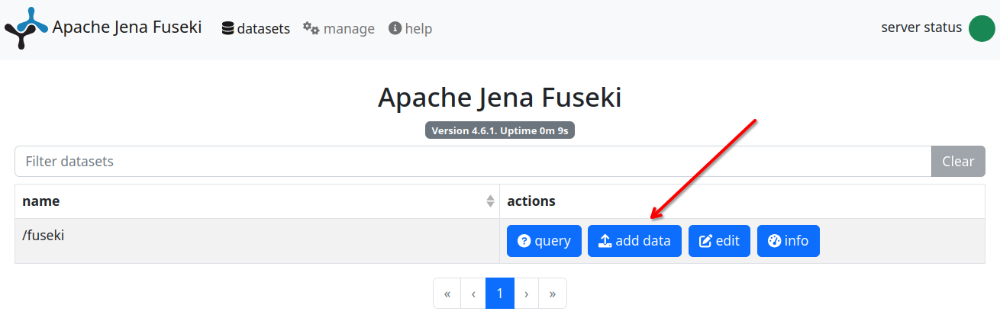
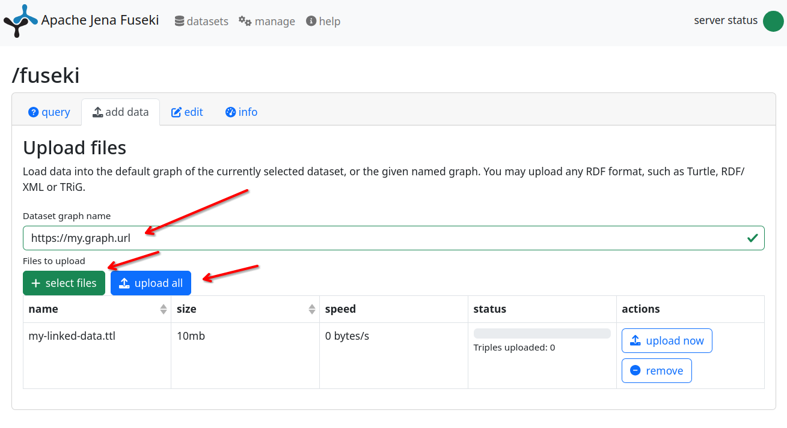

# Upload and view the data

With the OGC Definitions Service running and the uplifted JSON-LD file in
hand, we can now load the data into the triplestore and browse it as linked
data.

## About named graphs

Fuseki stores RDF data in **named graphs** — separate partitions of the
triplestore identified by a URI. Keeping each dataset in its own named graph
makes it easier to update or remove it later without affecting other data.

We will use the graph URI `https://example.com/rainbow/graphs/indicators` for
this tutorial. You can choose any URI; the convention is to use a URI that
reflects the content.

## Uploading the data

### Option A: Fuseki admin interface

1. Open http://localhost:3030 and log in.
2. Select your dataset (e.g. `fuseki`) from the list.
3. Click **add data**.

   

4. In the **Destination graph name** field, enter:
   `https://example.com/rainbow/graphs/indicators`
5. Upload `cdi-indicator.ttl`.
6. Click **upload now**.

   

### Option B: curl

:::caution Review required
The endpoint path and content type below assume the default Fuseki Graph Store
Protocol setup from the docker-compose.yml — adjust if your dataset name or
Fuseki version differs.
:::

```bash
# TODO: review dataset name and graph URI before running
curl -X PUT \
  -u admin:${FUSEKI_PASSWORD} \
  -H "Content-Type: text/turtle" \
  --data-binary @cdi-indicator.ttl \
  "http://localhost:3030/fuseki/data?graph=https://example.com/rainbow/graphs/indicators"
```

Set `FUSEKI_PASSWORD` to the value you configured in `docker-compose.yml`, or
replace `${FUSEKI_PASSWORD}` with the password directly.

### Option C: Python (requests + SPARQL Graph Store Protocol)

:::caution Review required
Verify the dataset name and graph URI match your deployment.
:::

```python
import os
import requests

FUSEKI_URL = "http://localhost:3030"
DATASET = "fuseki"   # TODO: review - must match the dataset name in Fuseki
GRAPH_URI = "https://example.com/rainbow/graphs/indicators"  # TODO: review
FUSEKI_PASSWORD = os.environ.get("FUSEKI_PASSWORD", "changeme")  # TODO: review

with open("cdi-indicator.ttl") as f:
    data = f.read()

response = requests.put(
    f"{FUSEKI_URL}/{DATASET}/data",
    params={"graph": GRAPH_URI},
    headers={"Content-Type": "text/turtle"},
    data=data,
    auth=("admin", FUSEKI_PASSWORD),
)
response.raise_for_status()
print(f"Uploaded successfully (HTTP {response.status_code})")
```

### Option D: OGC Naming Authority tools

The OGC Naming Authority provides higher-level tooling that automates
publishing and registration of definitions. This approach will be covered in
a dedicated tutorial.

## Browsing the resource

Once the data is loaded, open the Prez UI in your browser. The URL of the
indicator resource will be based on the `id` in your JSON-LD document combined
with the nginx-ld redirection configuration you set up in Section 1.

For the example document from Section 2, the resource URI would be:

```
https://example.com/rainbow/indicators/cdi/station-alpha/2024-07
```

The mappings that we configured for the nginx-ld server make it so
that this resource can be accessed at:

```
http://localhost:8080/rainbow/indicators/cdi/station-alpha/2024-07
```

Navigate to that path to see the Prez UI rendering of the resource.

<!-- TODO: add screenshot of the Prez UI result -->

## Retrieving the linked data representation

Use `curl` with `Accept: text/turtle` and follow redirects (`-L`) to retrieve
the RDF representation directly:

```bash
curl -L \
  -H "Accept: text/turtle" \
  "http://localhost:8080/rainbow/indicators/cdi/station-alpha/2024-07"

```

nginx-ld will redirect the request to the appropriate Prez endpoint, which
will return the resource serialized as Turtle RDF.

## Summary

You have successfully:

1. Deployed the OGC Definitions Service locally
2. Described the Composite Drought Indicator as a provenance chain
3. Validated and uplifted the document with `bblocks-client-python`
4. Uploaded the data to Fuseki and browsed it as linked data

The indicator is now published and accessible as a dereferenceable linked data
resource.
